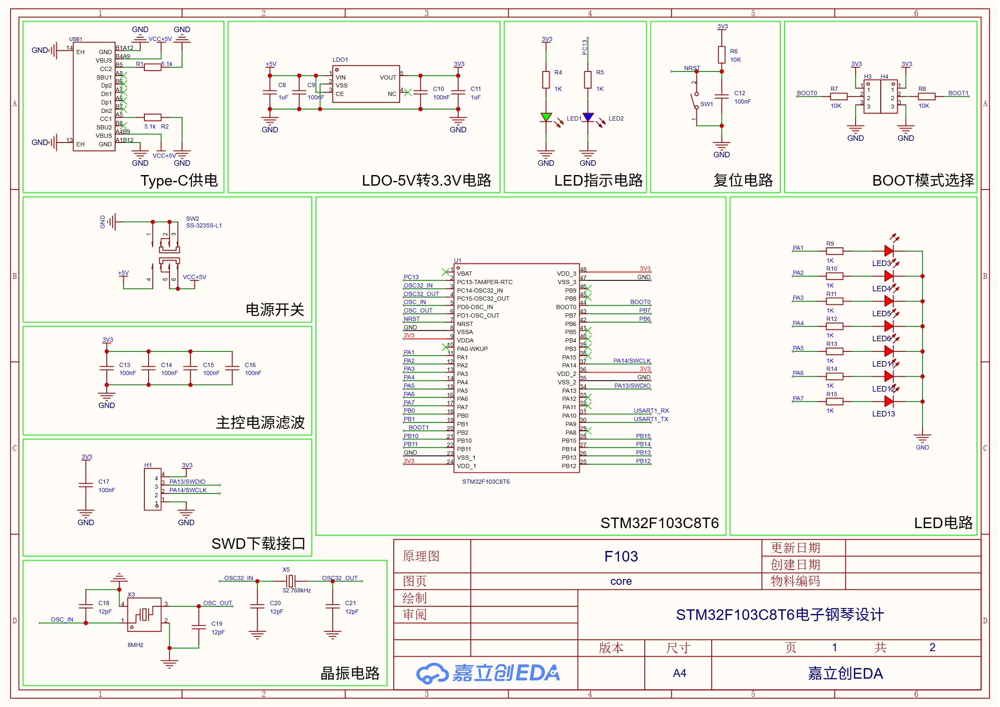
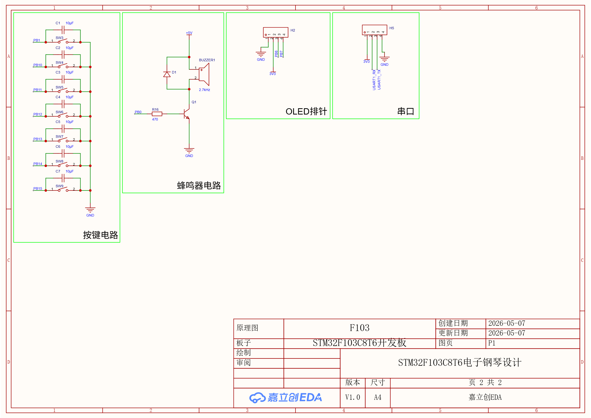
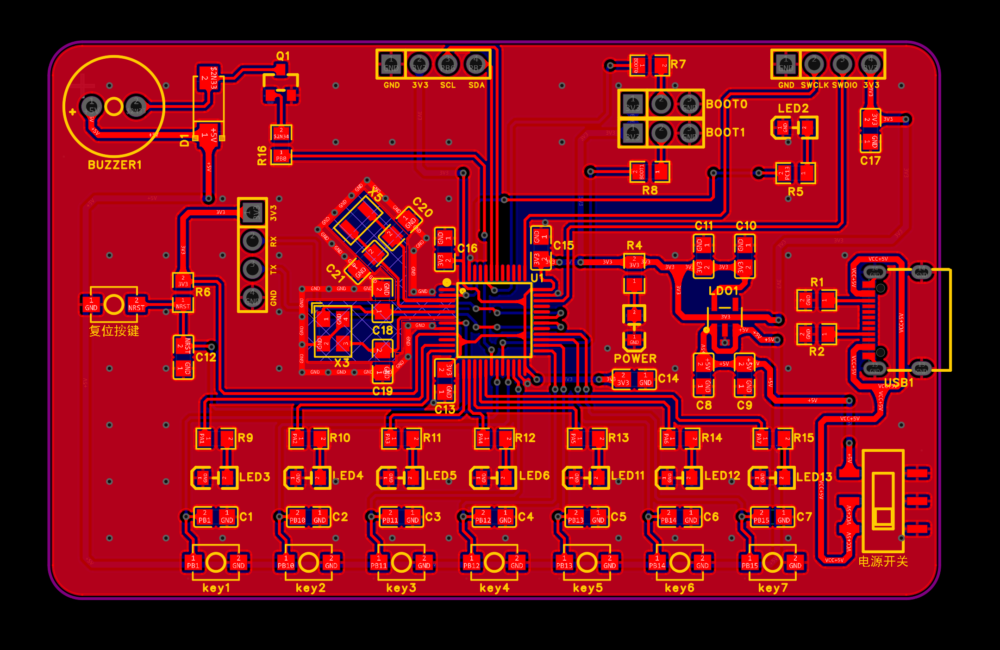

# STM32F103C8T6 电子钢琴

[](LICENSE)

基于 STM32F103C8T6（Cortex-M3）与 ST HAL 的裸机电子钢琴：7 个按键演奏 Do–Si 七个音，内置三首曲子可自动播放，配 OLED 菜单、LED 指示，并随附可直接下单打样的 PCB 制造文件。

## 功能特性

- **钢琴模式（Piano）**：7 个按键对应 Do / Re / Mi / Fa / So / La / Si，按下发声并点亮对应 LED（TIM3 PWM 驱动蜂鸣器）；
- **自动演奏（AutoPlay）**：内置《两只老虎》《小星星》《欢乐颂》，可上下选择、确认播放，播放中板载 LED（PC13）随节拍闪烁；
- **跑马灯（Marquee）**：7 个 LED 依次点亮并往返流动；
- **OLED 菜单**：0.96 寸 SSD1306，I2C 400 kHz，批量刷新避免闪烁；
- **串口调试**：USART1（115200，PA9/PA10）输出 `printf` 日志。
- **可靠性**：独立看门狗（IWDG，溢出约 2 s）监控主循环，异常卡死自动复位；长延时、按键等待与主循环中均会喂狗。

## 硬件组成与引脚分配

| 模块 | 引脚 | 说明 |
| --- | --- | --- |
| 主控 | STM32F103C8T6 | 72 MHz，64 KB Flash，20 KB RAM |
| 蜂鸣器 | PB0 | TIM3_CH3 输出方波驱动无源蜂鸣器（+5V 供电，三极管开关，D1 续流） |
| OLED 显示屏 | PB6 (SCL) / PB7 (SDA) | SSD1306 128×64，I2C1 400 kHz |
| LED × 7 | PA1 ~ PA7 | 高电平点亮 |
| 板载 LED | PC13 | 自动演奏节拍指示 |
| 按键 key1 ~ key5 | PB1 / PB10 / PB11 / PB12 / PB13 | Do / Re / Mi / Fa / So |
| 按键 key6 / key7 | PB14 / PB15 | La / Si |
| 退出组合键 | PB14 + PB15 同时按下 | 返回主菜单 |
| 串口调试 | PA9 (TX) / PA10 (RX) | USART1，115200-8-N-1 |

音符频率与定时器 ARR（PSC = 71，计数频率 1 MHz）：

| 音符 | Do | Re | Mi | Fa | So | La | Si |
| --- | --- | --- | --- | --- | --- | --- | --- |
| 频率 (Hz) | 262 | 294 | 330 | 349 | 392 | 440 | 494 |
| ARR | 3815 | 3400 | 3029 | 2864 | 2550 | 2271 | 2023 |

## 原理图与 PCB 预览



*图 1：主控核心*



*图 2：接口与电源*



*图 3：PCB 板卡预览*

## 目录结构

```text
├── User/                     # 应用层（main.c 状态机、歌曲数据、OLED 界面）
├── Drivers/
│   ├── BSP/                  # LED / OLED / BUZZER / KEY / TIMER 板级驱动
│   ├── SYSTEM/               # 自有时钟、延时、串口实现（MIT）
│   ├── CMSIS/                # Cortex-M3 内核与 STM32F1xx 设备头文件
│   └── STM32F1xx_HAL_Driver/ # ST HAL 库
├── Projects/MDK-ARM/         # Keil uVision 工程（project.uvprojx）
├── Hardware/PCB/             # 原理图 / Gerber / 钻孔 / 飞针测试文件（可直接下单）
└── README.md
```

## 开发环境与编译

1. 安装 Keil MDK-ARM uVision 5 与 ARM Compiler V5.06（ARMCC）；
2. 安装器件支持包 `Keil.STM32F1xx_DFP.2.4.1`；
3. 打开 `Projects/MDK-ARM/project.uvprojx`；
4. 按 `F7` 编译，生成 `Output/project.hex`。工程目标为 STM32F103C8，预定义宏 `USE_HAL_DRIVER, STM32F103xE`。

## 烧录

- **ULINK2 / J-Link / ST-Link**：在 Keil 的 Debug 设置中选择对应调试器后直接下载；
- **STM32CubeProgrammer**：连接 SWD 后选择 `Output/project.hex` 烧录。

## 使用说明

上电后 OLED 显示主菜单：

- `key1`（PB1）上移光标，`key2`（PB10）下移光标，`key3`（PB11）确认进入；
- **钢琴模式**：按下 key1~key7 演奏 Do~Si；同时按下 key6(PB14)+key7(PB15)（两键需几乎同时按下，约 0.1 秒内）返回菜单，先后按下则按 La、Si 两个音处理；
- **自动演奏**：选择歌曲后确认播放，播放中同时按下 PB14+PB15 返回菜单；
- **跑马灯**：LED 往返流动，同时按下 PB14+PB15 返回菜单；
- 串口以 115200 波特率输出启动日志，便于调试。

## PCB 制造

`Hardware/PCB` 目录包含立创 EDA 导出的原理图与全套制造文件，可直接下单：

- 原理图：`Schematic_Page1.png`、`Schematic_Page2.png`；
- PCB 预览：`PCB_Preview.png`；
- 各层 Gerber：顶层/底层铜、丝印、阻焊、助焊、板框等；
- 钻孔文件：通孔、过孔、非金属化孔（`.DRL`）；
- `FlyingProbeTesting.json`：飞针测试文件；
- `PCB下单必读.txt`：下单流程参考（嘉立创）。

## 许可

本项目采用 MIT License 发布，版权归 JaysonHZhu 所有，详见 [LICENSE](LICENSE)。欢迎 fork 和二次开发。

仓库内 `Drivers/STM32F1xx_HAL_Driver/`、`Drivers/CMSIS/`、`User/stm32f1xx_it.*` 等文件为 STMicroelectronics 与 Arm 提供的第三方代码，版权与许可条款见 [THIRD_PARTY_NOTICES.md](THIRD_PARTY_NOTICES.md)。

## 致谢

- [STMicroelectronics](https://www.st.com/) 提供 STM32F1xx HAL 驱动、CMSIS 设备头文件与启动文件（BSD-3-Clause）；
- [Arm](https://www.arm.com/) 提供 CMSIS Core 头文件（Apache-2.0）。
